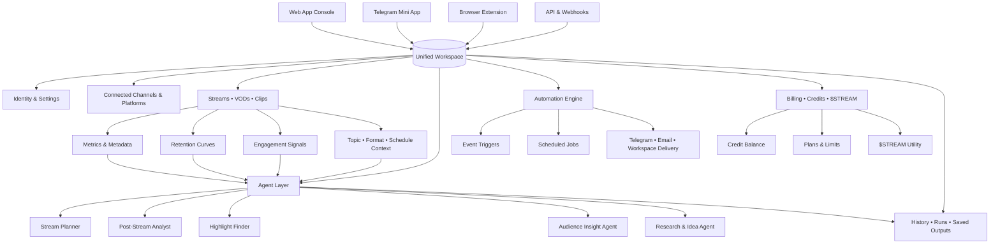
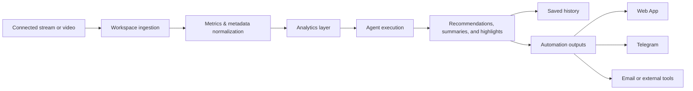

  

<h1 align="center">Streamora AI</h1>

  
<strong>AI-native workspace for stream planning, live optimization, audience insight, and content repurposing</strong>

  

    Stream analytics • AI agents • Highlights • Automation • Credits powered by $STREAM
  

  
  
  
  
  

---

## What’s Broken

Live content creators usually work across too many disconnected surfaces. Planning happens in notes, stream review happens inside platform dashboards, highlight ideas live in chats or drafts, and performance decisions are often made from memory instead of structured feedback.

That fragmentation slows down iteration. By the time a creator understands what worked, the next stream is already live and the learning loop is gone.

| Broken part of the workflow | What usually happens today | What gets lost |
|---|---|---|
| Stream planning | Topics, segments, hooks, and overlays are prepared manually across scattered tools | Time before each stream |
| Live optimization | Retention drops and chat spikes are noticed too late or not reviewed in context | Engagement and pacing decisions |
| Post-stream review | Metrics are visible, but the reasoning behind performance is unclear | Repeatable lessons |
| Repurposing | Clips are chosen by intuition, not by engagement signals | Reach across Shorts, Reels, and TikTok |
| Team coordination | Notes, analytics, and actions are spread between apps | Consistency and speed |

> [!WARNING]
> Most creator tools show data after the fact, but do not help transform that data into a repeatable operating system for the next stream

### Current workflow

A creator plans a show in one tool, streams on another platform, checks analytics in a dashboard later, and then manually decides what to cut into clips, what to repeat next week, and what to test again. Even when the data exists, it is rarely connected to creative execution.

### Where time and money are lost

Time is lost in setup, review, and context switching. Money is lost when strong streams are not replicated, weak intros keep repeating, and good moments are never turned into distributable content.

### Why existing solutions fail

Most tools cover only one slice of the workflow. Analytics tools focus on reporting. AI writing tools generate ideas without stream context. Repurposing tools find clips but do not connect them to audience behavior, agent history, or future planning.

---

## The Shift

Streamora AI replaces scattered creator tooling with one AI-native workspace shared across the Web App, Telegram Mini App, Browser Extension, and API layer.

Instead of treating planning, analysis, highlights, and automation as separate tasks, Streamora turns them into one loop built on the same workspace, the same context, and the same agent history.

| Instead of | Streamora AI does |
|---|---|
| Reviewing streams manually after they end | Connects analytics, audience signals, and AI summaries in one workspace |
| Using generic prompts for content ideas | Runs specialized agents with stream data, notes, and performance context |
| Picking clips by guesswork | Surfaces highlight candidates from engagement and retention signals |
| Managing separate tools for creation and review | Syncs Web App, Telegram Mini App, Browser Extension, and API into one system |

> [!IMPORTANT]
> Streamora is not just an analytics dashboard and not just an AI wrapper. It is a creator workflow layer that connects planning, performance, repurposing, and automation

---

## Product View

Streamora AI is one shared workspace with multiple surfaces around it, but the intelligence sits deeper than a simple hub-and-spoke model.

The result is a single operating layer for creators: one identity, one history, one credit system, and one place where planning inputs and performance outputs stay connected.

---

## Proof

The value of Streamora becomes obvious when the workflow is viewed before and after the workspace is unified.

| Before Streamora | After Streamora |
|---|---|
| Stream plan is drafted manually and rarely reused | Agents generate outlines, segment ideas, and talking points from past context |
| Performance review is metric-heavy and slow to interpret | AI summaries explain what likely happened and what to change next |
| Highlights are selected manually after long review sessions | Engagement and retention signals surface strong moments faster |
| Teams pass notes between apps and chats | Shared workspace keeps runs, outputs, and saved media aligned |

### Real scenario

A creator finishes a 90-minute live session. Instead of exporting notes, opening multiple dashboards, and manually hunting for standout moments, they open Streamora and get a post-stream analysis, a shortlist of highlight candidates, and concrete suggestions for the next session’s intro, pacing, and segment order.

### Impact

| Area | Typical improvement path |
|---|---|
| Planning speed | Less manual prep and fewer repeated decisions |
| Review quality | Faster understanding of why a stream overperformed or underperformed |
| Repurposing output | More clip candidates tied to real audience behavior |
| Team coordination | Shared history across agents, streams, and saved outputs |

> [!TIP]
> The strongest proof is not a flashy metric. It is the ability to turn one finished stream into a better next stream with less friction

---

## Try the Core Flow

The fastest path to an aha moment in Streamora is simple.

| Step | Action | Outcome |
|---|---|---|
| 1 | Connect your workspace and content surfaces | Streamora starts building unified context |
| 2 | Open a recent stream in the Web App | Metrics, retention, and engagement become reviewable in one place |
| 3 | Run the post-stream agent | You get a readable summary plus recommendations |
| 4 | Review suggested highlights | Strong moments are easier to repurpose |
| 5 | Use the planner for the next stream | Past performance directly shapes future structure |

This is where the shift happens: the platform stops being a storage layer for content and becomes an operating layer for decisions.

---

## Real Scenarios

### 1) Solo creator trying to improve retention

A solo creator streams consistently but cannot tell why some sessions hold viewers and others lose them early.

| Context | Before | After |
|---|---|---|
| Weekly live show with variable performance | Looks at platform analytics and guesses what changed | Uses retention curves, AI comments, and stream context to identify weak intros and strong segments |

### 2) Small production team running recurring shows

A small team produces recurring streams and wants cleaner planning, review, and handoff between members.

| Context | Before | After |
|---|---|---|
| Shared production across multiple people | Notes, tasks, and clip ideas are split across chats and docs | Shared workspace keeps runs, analyses, saved outputs, and automation results in one place |

### 3) Creator repurposing content for short-form platforms

A creator wants to turn long streams into short clips without spending hours reviewing raw footage.

| Context | Before | After |
|---|---|---|
| Multi-platform content distribution | Clips are selected by instinct and posted inconsistently | Highlight suggestions are driven by audience reactions, engagement spikes, and stream context |

---

## Mechanics

Under the hood, Streamora keeps the workflow light for the user even though several systems work together in the background.

The platform does not ask the user to engineer every prompt from scratch. It turns streams, notes, metrics, and context into structured inputs that specialized agents can actually use.

> [!NOTE]
> Credits are consumed by AI-powered actions such as analyses, generations, and agent runs, while $STREAM is the utility token used for subscriptions, top-ups, and broader ecosystem mechanics

---

## Surfaces at a Glance

| Surface | Primary role | Best used for |
|---|---|---|
| Web App | Main workspace | Setup, analytics, planning, billing, and history |
| Telegram Mini App | Fast access surface | Notifications, quick checks, lightweight follow-ups |
| Browser Extension | In-context utility | Analyze pages, save content, and trigger actions without leaving the browser |
| API & Webhooks | Programmatic layer | Integrations, automations, internal tools, and external workflows |

---

## vs Alternatives

| Option | Difference |
|---|---|
| Generic AI writing tools | Good at generating text, weak at using real stream metrics and workspace history |
| Native platform dashboards | Good at showing raw numbers, weak at connecting them to planning and repurposing |
| Manual workflow | Flexible, but slow, fragmented, and difficult to scale or repeat consistently |

The positioning is simple: Streamora is not trying to replace every creator tool. It is trying to unify the parts that creators keep repeating across every stream cycle.

---

## Failure Modes

Credibility matters more when a product clearly states where it is not the right fit.

| Situation | Why Streamora may not be the best fit |
|---|---|
| Very low publishing volume | If you stream rarely, the full workflow layer may be more than you need |
| Purely manual creative process | Some creators prefer intuition over structured review and iteration |
| No need for cross-surface coordination | If you do not need analytics, agents, repurposing, or automation together, lighter tools may be enough |
| Minimal operational complexity | For simple one-off content, old methods can still be faster |

> [!CAUTION]
> Streamora helps most when there is enough content volume, enough repetition, or enough team coordination for workflow compounding to matter

---

## Security, Privacy, and Trust

Trust is not a footer section. It is part of the product logic.

| Area | Streamora approach |
|---|---|
| Account protection | Workspace-based identity with controlled access and account-level protections where available |
| Sensitive data | Hardened storage for secrets and API keys, with least-privilege access patterns |
| Wallet safety | No seed phrase or private key collection or storage |
| Data isolation | Logical separation between workspaces |
| Privacy | No sale of personal data and no external third-party model training on private user content outside service delivery and improvement scope |

---

## API and Automation

For teams, studios, and advanced users, Streamora can also work as an automation layer.

| Capability | Example |
|---|---|
| Agent execution | Run a post-stream analyst asynchronously and fetch results by job ID |
| Analytics access | Pull stream metrics, retention, and engagement into internal workflows |
| Webhooks | Receive events such as `job.completed`, `credits.low`, or `plan.changed` |
| Integrations | Route outputs to Telegram, email, task systems, or internal reporting stacks |

This makes Streamora usable both as a product interface and as a programmable backend for creator operations.

---

## Why Streamora

Streamora AI is built for creators who do not just want more dashboards, more prompts, or more scattered tools. It is for people who want one system that helps them plan better, stream smarter, review faster, and repurpose with context.

Pain creates the need  
The shift creates the model  
Proof creates belief  
Trust makes the system usable

That is the logic behind Streamora AI
